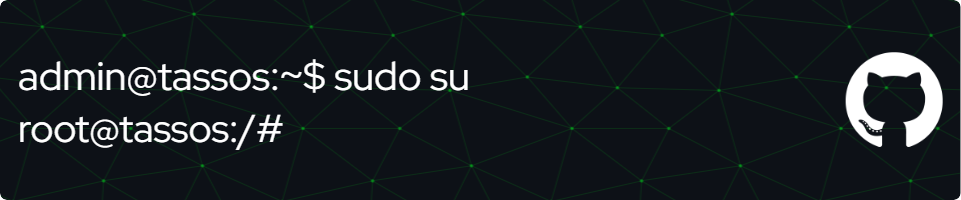

# About Me:
I’m learning more about pentesting and development in my spare time. 
Right now I'm experimenting with coding, learning new languages, and building projects to improve my coding skills.

**Currently learning:**
 

## Familiar with:
**Web:**
 

 
**Dev Tools:**
 

 
**OS:**
 

